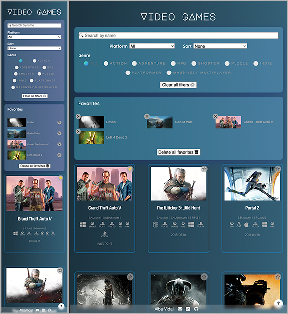
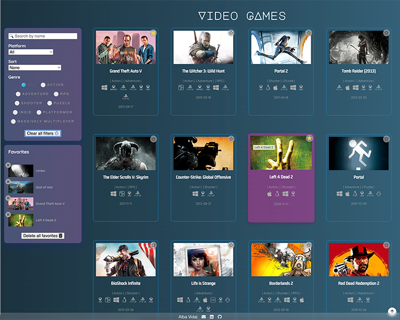

# 🎮 Video games search engine

The project consists of a website with a list of video games, which we can filter by name, platform and genre. We can also sort the list alphabetically or by release date and save your favourite games in your local storage. Also if you click on a game you will navigate to its page where you will find more details as well as screenshots of the game.

## Table of contents

- [Overview](#overview)
  - [The challenge](#the-challenge)
  - [Further implementations](#further-implementations)
  - [Screenshots](#screenshots)
  - [Links](#links)
- [My process](#my-process)
  - [Built with](#built-with)
  - [What I learned](#what-i-learned)
- [Author](#author)

## Overview

### The challenge

- List of video games.

  - I have used the service https://api.rawg.io/api/games which returns information on 20 games. On each one I have rendered:
    - Name
    - Cover
    - Id
    - Score
    - Release date
    - Gender
    - Platform
    - Screenshots
    - Languages

- Filtering characters.

  - When typing a name in the input, only the video games whose name contains the written letters will be displayed in the interface.
    It does not take into account if the letters are in upper/lower case.

- Videogame detail.

  - When clicking on a video game card, its information will appear in its own page using routes and React router.
  - In the detail screen, a carousel appears with different screenshots, name, platforms, genre, languages, rating and release date.
  - When entering the detail of a game and then the user presses back, the text field will show the text it had previously.
  - The platform is represented by an icon I created with the platform logo.

- URLs

  - The URL of the video game detail is sharable, i.e. if we visit this URL directly in the browser, the detail of the video game is displayed. If we refresh the browser in the detail of a video game, it will show the detail of the video game again.
  - If the user navigates to a non-existent URL, a page with the message "We can't find this game" will be displayed.
  - If the interface does not find the video game searched for (by filling in the filters), the message "No video game matches your search" will be displayed.

- Local storage

  - Add to local storage the API information (avoiding continuous API requests).
  - It also stores the list of the user's favourite video games.

- Skeleton loading

  - While waiting to receive API information we will see a skeleton loading screen. It helps to keep users' attention, as well as informing them that loading processes are running.

- Responsive design

  - I've created a different design for: mobile, tablet and desktop.

- Animations
  - The APP title displays an animation when loading.
  - The filters background has an animation that change its colour.

### Further implementations

I'm working on the API pagination so that the user can navigate through the entire list of video games.

### Screenshots

### Links

- Code: [https://github.dev/albavidalm/videogames-searcher/](https://github.dev/albavidalm/videogames-searcher)
- Live: [https://albavidalm.github.io/videogames-searcher/](https://albavidalm.github.io/videogames-searcher/)

## My process

### Built with

- HTML5
- CSS3
- Grid
- Sass
- API
- React
- React image gallery
- React loading skeleton

### What I learned

This is the first time I use the React image gallery and the React loading skeleton library.

## Author

- GitHub: [https://github.com/albavidalm](https://github.com/albavidalm)
- Email: [albavidalm @ gmail.com](mailto:albavidalm@gmail.com?subject=Hi)
- Linkedin: [https://www.linkedin.com/in/albavidalm/](https://www.linkedin.com/in/albavidalm/)

## 🖤 Support

Sharing is caring, contributions, PR and suggestions are always welcome.
