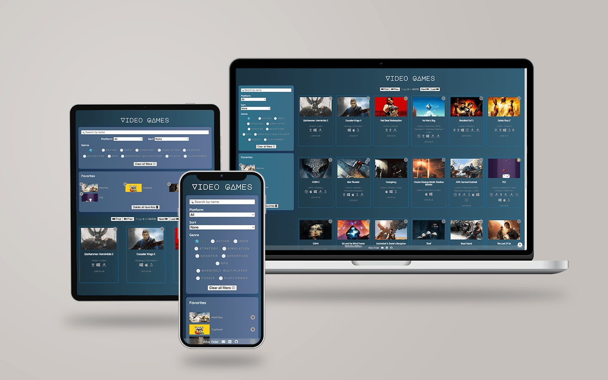

# 🎮 Video games search engine

The project consists of a web page with a list of video games that we can filter by name, platform and genre. We can also sort the list alphabetically or by release date and save our favourite games to our local storage. Furthermore, if we click on a game we will navigate to its own page where we will find more details as well as screenshots of the game.

If the game we type in the Search field does not exist, a message will appear on our screen warning us of this.

If you search for a game by its API reference number in the search bar of your browser and it does not exist, you will also receive a new message.

This project has a Responsive design ready for mobile, tablet and desktop.

## Screenshots



<br>

---

## Table of contents

- [My process](#my-process)

  - [Why this project?](#why-this-project)
  - [Elements that I have to show and structure](#elements-that-i-have-to-show-and-structure)
  - [Built with](#built-with)
  - [API reference](#api-reference)
  - [What happens on the web?](#what-happens-on-the-web)
  - [Decissions](#decissions)
  - [What I learned](#what-i-learned)

- [Further implementations](#further-implementations)
- [Links](#links)
- [How can you run this project](#how-can-you-run-this-project)
- [Author](#author)
- [Support](#support-🖤)

<br>

---

## My process

<br>

### Why this project?

I wanted to do a project from scratch, both in terms of programming and design.

My goal was to work with a video game API and be able to search by name, platform and genre (the features I look at most when I'm looking for one). I also wanted the genres and platforms to be dynamically updated according to the data provided by the API on that page.

Another goal I wanted to achieve was to use Skeleton when there was no data to display yet.

Another challenge I wanted to achieve was that the user could paginate the data. In addition, I wanted the user to be able to save his favourite games on his computer.

<br>

### Elements that I have to show and structure

#### Show

- **Main page**
  - Header
  - Filters
    - Search by name
    - Search by platform
    - Sort
      - By name
      - By release date
    - Filter by genre
    - Reset filter
  - Favorites
  - Pagination
  - List of games

<br>

- **Game page**
  - Header
  - Go back button to Main page
  - Carousel of images from the game
  - Game info

<br>

#### Structure

```bash
├── LICENSE
├── README.md
├── docs
├── .gitignore
├── node_modules
├── package-lock.json
├── package.json
├── public
└── src
    ├── assets
    │   └── images
    ├── components
    ├── hooks
    ├── index.js
    ├── services
    │   ├── getApiData.js
    │   ├── getIconPlatform.js
    │   └── local-storage.js
    └── stylesheets
```

<br>

### Built with

- [npm](https://www.npmjs.com/) Version 6.14.12
- [HTML5](https://developer.mozilla.org/en-US/docs/Web/HTML)
- [CSS3](https://developer.mozilla.org/es/docs/Web/CSS)
- [Grid](https://developer.mozilla.org/es/docs/Web/CSS/CSS_Grid_Layout)
- [Sass](https://sass-lang.com/)
- API: [RAWG Video Games Database API](https://rawg.io/apidocs)
- [React 18](https://es.reactjs.org/)
- [React Router](https://reactrouter.com/en/6.6.1/start/overview)
- [React image gallery](https://www.npmjs.com/package/react-image-gallery)
- [React loading skeleton](https://www.npmjs.com/package/react-loading-skeleton)

<br>

### API Reference

The API used for this project is [RAWG Video Games Database API](https://rawg.io/apidocs)

You can find all the API information and documentation here: https://api.rawg.io/docs/

All API requests require the use of a generated API key, so to run the project you will need your own API key and you can generate this API key here: https://rawg.io/login?forward=developer

| Parameter | Type     | Description                |
| :-------- | :------- | :------------------------- |
| `key`     | `string` | **Required**. Your API key |

Due I needed a list of games and its information related I worked with the next **endpoint**:

**Get all games**

```http
  GET /api/games
```

**Responses**

```bash
{
  "count": 0,
  "next": "http://example.com",
  "previous": "http://example.com",
  "results": [
    {
      "id": 0,
      "slug": "string",
      "name": "string",
      "released": "2023-01-07",
      "tba": true,
      "background_image": "http://example.com",
      "rating": 0,
      "rating_top": 0,
      "ratings": {},
      "ratings_count": 0,
      "reviews_text_count": "string",
      "added": 0,
      "added_by_status": {},
      "metacritic": 0,
      "playtime": 0,
      "suggestions_count": 0,
      "updated": "2023-01-07T18:05:52Z",
      "esrb_rating": {
        "id": 0,
        "slug": "everyone",
        "name": "Everyone"
      },
      "platforms": [
        {
          "platform": {
            "id": 0,
            "slug": "string",
            "name": "string"
          },
          "released_at": "string",
          "requirements": {
            "minimum": "string",
            "recommended": "string"
          }
        }
      ]
    }
  ]
}
```

<br>

### What happens on the web?

#### Entering for the first time

- The first time the user enters the website, it starts the hook useFetchGames which through various states such as isLoading or games determines that there is no data to display and renders the skeleton layout. It helps to keep users' attention, as well as informing them that loading processes are running.

- This hook by its useEffect also call the service `getApiData` that set the states: setIsLoading as false (because we have data now), `setGames` (the games information that I need and that I previously prepared at getApiData), `setPrevPage`(to get the previous page in each page and that we'll need for the pagination), `setNextPage`(to get the next page in each page and that we'll need for the pagination), `setTotalGames`(to get the total number of games that the API returns and we'll need to calculate the pagination). In this hook I also coded the functions that paginate.

#### When we have data

- Cool, now that we have data and several states are loaded the useEffect at VideogamesApp will look for data in the user's local storage, if exists, the favorites will be loaded, if not it will apear an empty box to add them. Now we can see our favorite list (if exists), the game filters, page navigation and a list of 20 games and on each one I have rendered:

  - Name
  - Cover
  - Id
  - Score
  - Release date
  - Genre
  - Platform (instead the platform game I designed a logo and this is what you'll see)
  - Screenshots
  - Languages

#### Filtering

I have used the array `.filter()` method to search for the matching elements that I have indicated in the callback and that are the values that the user has selected. All the filters are controlled by a "form" and interact with each other.

- **By name**: When typing a name in the input, only the video games whose name contains the written letters will be displayed in the interface. It does not take into account if the letters are in upper/lower case. This is because I indicated that the videogame name that came from data API has to be "transformed" with `toUpperCase()` and the text in the name user search too.

- **By platform**: All the platforms that exist in the 20 games returned by the API will be listed in the Filter by platform of the left menu and the user will be able to choose the one he/she prefers by means of a select. If the value of that select is contained in the games in the list, only the games that have that platform will be shown.
  ```bash
  .filter((game) => {
      return platformFilter === "all"
        ? true
        : game.platforms.includes(platformFilter);
    });
  ```
- **By genre**: It works pretty similar as the platform filter but with a radio button. We receive an array of data but in this case we create the function `getGenres()` that will map the data that arrives to it.
  Within the FilterByGenre component we are going to "clean" this new data to generate the `genresListClean` array that will show us only the games that contain that genre.

- **Sort**: In this case the user chooses how to sort the games by means of a select.
  As the only thing we want is to visualise the data we receive but in a specific order here the .filter() method does not make sense and what we need is the array method `.sort()`. All this logic is developed in the FilterSort component and would work like this:

  | Condition                                                                | Code                  |
  | ------------------------------------------------------------------------ | --------------------- |
  | If they are `equal`, we return 0                                         | `if a === b return 0` |
  | If `a` must be sorted before `b`, then we return a number less than 0    | `if a < b return -1`  |
  | If `a` must be ordered after `b`, then we return a number greater than 0 | `if a > b return 1`   |

#### Favorites

- In each card game is rendered a star, this is the button to add or delete a game from the favorites list.

- It works between the main VideoGamesApp component and the Favourites component, the latter is the one that will display our list.

- I have created the function `favoriteGame()` which receives a parameter that I have called `clickedGame` and is the id of the card game that the user has clicked on. This function works with the `.find()` method and looks for this game id and returns it. If this id is not defined we will create a new array that will set our `favorites` state with this new information.

- If the user clicks on the star of the game again, either in the general listing or in the X of the Favorites menu, that game will be removed from the array.
  With the "Delete all favorites" button we update the `favorites` state to an empty array.

#### Videogame detail.

- When clicking on a video game card, its information will appear in its own page using routes and React router.
- In the detail screen, a carousel appears with different screenshots, name, platforms, genre, languages, rating and release date.
- When entering the detail of a game and then the user presses back, the text field will show the text it had previously.
- The platform is represented by an icon I created with the platform logo.

#### URLs

- The URL of the video game detail is sharable, i.e. if we visit this URL directly in the browser, the detail of the video game is displayed. If we refresh the browser in the detail of a video game, it will show the detail of the video game again.
- If the user navigates to a non-existent URL, a page with the message "We can't find this game" will be displayed.
- If the interface does not find the video game searched for (by filling in the filters), the message "No video game matches your search" and the name searched by user will be displayed.

#### Animations

- The APP title displays an animation when loading.
- The filters background has an animation that change its colour.
- When user pass mouse over a game card the color change and has little zoom effect.

<br>

### Decissions

- Clean the data I receive from the API to keep only the information I'm interested in and not all the data returned by default by the response.

- In the filters, in order to have a more dynamic feel, I have made that
  when the user enters values, these changes are reflected in the app by making the `handleSubmit` function only have the `ev.preventDefault()`. I preferred this option instead of adding another API call and saving values with the setStates.

- I know that FilterByGenre is not the best component, at first I wanted the user to be able to select more than one genre at a time but this task was very difficult for me at the time so I decided to let this component rest and improve it in the future.

<br>

### What I learned

In every project I confirm the same thing: the better you prepare in advance, the faster you advance and the better you manage your time.

I learned to prepare my own hook (useFetchGame) to control the loading state and the data that i want to show and as well the paginaton that was the very first time that I made one.

Also, this is the first time I use the React image gallery and the React loading skeleton library.

<br>

---

<br>

### Further implementations

- Testing is very important, so far I haven't had time to add to it but it is one of the first tasks I have pending.

- I would like to improve the pagination, especially the call to the last page.

- Fix some bugs in the design like centering the title on the Game not found page or the button to go up on the page.

- Continue to design platform logos and add them to avoid "image not found".

- Add a function to calculate the time a videogame has been on the market.

- Hide my API key.

- I'm aware that I can still improve and refactor the code and break it down into smaller components.

<br>

---

<br>

### Links

- Live: [https://albavidalm.github.io/videogames-searcher/](https://albavidalm.github.io/videogames-searcher/)
- Code: [https://github.dev/albavidalm/videogames-searcher/](https://github.dev/albavidalm/videogames-searcher)

<br>

---

<br>

### How can you run this project

- Once you've download or cloned the project, install it with:

  ```bash
  npm install
  ```

- After that, if you want to run it in local execute this command:
  ```bash
  npm start
  ```

<br>

---

<br>

## Author

[](mailto:albavidalm@gmail.com?subject=Hi)
[](https://www.linkedin.com/in/albavidalm//)
[](https://twitter.com/albavidal_m)
[](https://github.com/albavidalm)

<br>

---

<br>

## Support 🖤

Sharing is caring, contributions, PR and suggestions are always welcome.
